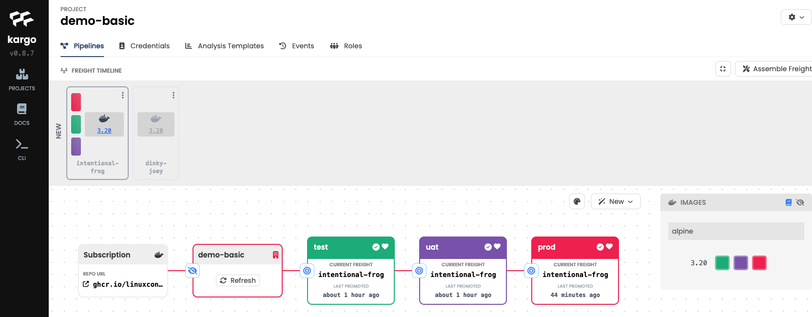
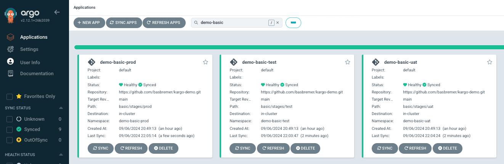
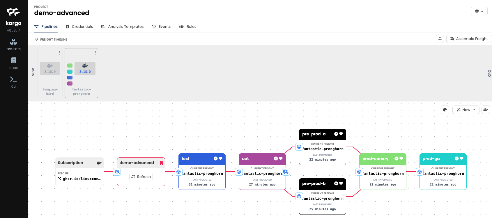
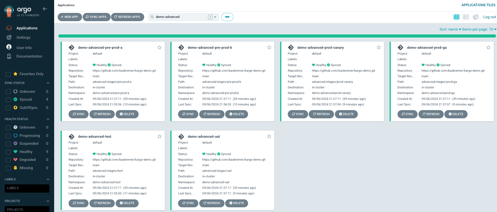

# workshop-kargo

## Steps for workshop

1. Go to [this repository](https://github.com/thisurlneedstobadded!!!!!) and fork it.\
    Copy the URL of this forked repo, because you'll need in the next step.

2. replace the value for environment variable **GITOPS_REPO_URL** in the [Dockerfile](.devcontainer/Dockerfile) with the repo you just forked.

3. Start the dev container, which can be done in 2 ways:
    * Open GitHub, clone this repo and open it locally in Visual Studio Code\
        *Instructions*
    * Go to this Repo in GitHub and open Codespaces\
        *Instructions*

4. When the container starts, the following tools are installed:
    * **Kind cluster**\
        Kargo needs to run on a Kubernetes cluster.\
        Therefore we will create a Kubernetes cluster using kind.
    * **Cert-Manager**\
        Cert-manager is used for self-signing a certificate used to identify Kargo's webhook server to the Kubernetes API server. 
    * **ArgoCD**\
        To deploy applications to the Kubernetes cluster, ArgoCD needs to be available.
    * **Argo-Rollouts**\
        To use analysis templates, Argo Rollouts is needed.
    * **Kargo**\
        Abviously Kargo is needed for this workshop :-)

>**INFO**\
>[Task](https://taskfile.dev/) is used to orchestrate all these scripts.\
>[Gum](https://github.com/charmbracelet/gum) is used for structured logs and user like interface.

5. If you don't have a GitHub token, start creating one.\
    This needs to be a classic token, creation is explained in [this guide](https://docs.github.com/en/authentication/keeping-your-account-and-data-secure/managing-your-personal-access-tokens)


### Basic Scenario
With these next steps we will start the basic scenario.

6. We are now going to apply the configuration in the kubernetes cluster.\
    To make it easy for you, I've prepared some manifests, which can be found in folder [demo-basic](./demo-basic).\
    The following parts are created:
    * ArgoCD ApplicationSet
    * Kargo Project
    * Kubernetes secret containing the repository credentials
    * Kargo Warehouse
    * Kargo Stages
    To apply the change I've created a taskfile, which will inject certain values.\
    You can apply the code with the following command:
    ```bash
    task init_basic
    ```
    >**Important!**\
    >Have a look at the manifests that are applied, which are in folder [demo-basic](./demo-basic).\
    >Important for the flow are the stages.\
    >To get a better understanding of the flow, take a look at the promotionMechanisms.\
    >Look for the difference between the test and other stages.

7. Now we are going to have our first experience with the Kargo CLI (which is preinstalled in this environment.).\
    First let's check if the Kargo CLI is working correctly.
    ```bash
    kargo
    ```
    The result should look like this:
    ```bash
    Usage:
    kargo [flags]
    kargo [command]

    Available Commands:
    apply       Apply a resource from a file or from stdin
    approve     Manually approve a piece of freight for promotion to a stage
    completion  Generate the autocompletion script for the specified shell
    config      Manage Kargo CLI configuration
    create      Create a resource from a file or from stdin
    dashboard   Open the Kargo Dashboard in your default browser
    delete      Delete resources by file and names
    get         Display one or many resources
    grant       Grant a role to a user or grant permissions to a role
    help        Help about any command
    login       Log in to a Kargo API server
    logout      Log out of the Kargo API server
    promote     Promote a piece of freight
    refresh     Refresh a stage or warehouse
    revoke      Revoke a role from a user or revoke permissions from a role
    server      Start a local Kargo API server
    update      Update a resource
    verify      Verify a stage
    version     Show the client and server version information

    Flags:
    -h, --help   help for kargo

    Use "kargo [command] --help" for more information about a command.
    ```
    To interact with the environment we need to log in to Kargo:
    ```bash
    kargo login https://localhost:31444 --admin --password=admin --insecure-skip-tls-verify
    ```
    After that let set the project for the next steps using the following command:
    ```bash
    kargo config set-project "demo-basic"
    ```
    Now let's start reviewing our applied configuration with some commands.

    Check the Projects:
    ```bash
    kargo get projects
    ```

    Check the Warehouses
    ```bash
    kargo get warehouses
    ```

    Check the Stages
    ```bash
    kargo get stages
    ```

    Check the Freight
    ```bash
    kargo get freight
    ```

    All these commands should show you some output.

8. Now we have a solid base where we can work with.\
    Let's start promoting the tst stage.\
    This promotion makes it possible to promote the image from the piece of freight to the stage.\
    To do this, we first need to know which freight is available with the following command:
    ```bash
    kargo get freight
    ```
    Copy the Alias, which we need in the next command:
    ```bash
    kargo promote --freight-alias=<Alias freight> --stage=test

    ## Use the following command to follow the status (exit with ctrl + c)
    watch kargo get promotions
    ```

9. It's not only possible to view the result on the commandline, but also in the Kargo Dashboard.\
    Normally you can open this by the command:
    ```bash
    kargo dashboard
    ```
    Unfortunately this doesn't work in the dev container, so please [click here](https://localhost:31444) (ignore certificate errors, just proceed to the website).\
    Login with user **admin** and password **admin** and click on the project **demo-basic**.

10. After the promotion a process in ArgoCD is started to deploy the application through ArgoCD.\
    To view this process go to ArgoCD by [clicking here](https://localhost:31443) (ignore certificate errors, just proceed to the website).\
    Login with user **admin** and password **admin**.\
    If you want to see progress from the application, click on the tst application.\
    You should be able to see a fully deployed application.

11. Now I've explained how you can handle the promotion to stages, so you should be able to do it yourself.\
    Before you start promoting the normal way of promoting, first try to directly promote to prod.\
    You should retrieve an error, but there is a way of working around this (in case of emergency).\
    Kargo has the possibility to approve a piece of freight for a certain stage.\
    This can be applied using the following command:
    ```bash
    kargo approve --stage prod --freight-alias <Alias freight>
    ```

12. Once done your Kargo dashboard should look something like:
    
    ArgoCD should look like:
    

13. If you want to check, you can see all workloads running on the workshop cluster.\
    Just run the following command:
    ```bash
    kubectl get pods -A -l "project=demo-basic"
    ```

### Advanced Scenario
14. We are now going to apply the configuration of the advanced scenario in the kubernetes cluster.\
    To make it easy for you, I've prepared some manifests, which can be found in folder [demo-advanced](./demo-advanced).\
    The following parts are created:
    * ArgoCD ApplicationSet
    * Kargo Project
    * Kubernetes secret containing the repository credentials
    * Kargo Warehouse
    * Kargo Stages
    To apply the change I've created a taskfile, which will inject certain values.\
    You can apply the code with the following command:
    ```bash
    task init_advanced
    ```
    As you can see this scenario has way more stages and different dependencies.\
    Also a new element is introduced, which is analysis templates, which we will use later on in this scenario.
    >**Important!**\
    >Have a look at the manifests that are applied, which are in folder [demo-advanced](./demo-advanced).\
    >Compared to the basic demo there are more changes then only the number of stages.\
    >The kargo.yaml file now also has analysistemplates, which you will see later during the workshop.

15. Let's check if all stuff is deployed correctly
    First set the correct project:
    ```bash
    kargo config set-project "demo-advanced"
    ```
    Now let's start reviewing our applied configuration with some commands.

    Check the Projects (you will now see 2 projects):
    ```bash
    kargo get projects
    ```

    Check the Warehouses
    ```bash
    kargo get warehouses
    ```

    Check the Stages
    ```bash
    kargo get stages
    ```

    Check the Freight
    ```bash
    kargo get freight
    ```

    All these commands should show you some output.

16. Like we've did with the basic scenario, we should promote the test stage.\
    In order to do that, we first need to get the freight (which differs from the basic demo).
    ```bash
    kargo get freight
    ```
    After that, copy the Alias which we need in the next command:
    ```bash
    kargo promote --freight-alias=<Alias freight> --stage=test

    ## Use the following command to follow the status (exit with ctrl + c)
    watch kargo get promotions
    ```
    >**INFO**\
    >Feel free to have a look at [the dashboard](https://localhost:31444).\
    >Now you should see two projects, choose *demo-advanced*.

17. Like with the basic demo, we also have to promote the other stages.\
    Let's start with promoting to uat.
    ```bash
    kargo promote --freight-alias=<Alias freight> --stage=uat

    ## Use the following command to follow the status (exit with ctrl + c)
    watch kargo get promotions
    ```

18. Now lets promote to pre-prod-b **(not pre-prod-a!)**.
    ```bash
    kargo promote --freight-alias=<Alias freight> --stage=pre-prod-b

    ## Use the following command to follow the status (exit with ctrl + c)
    watch kargo get promotions
    ```
    Here's a big difference compared to basic demo.\
    An analysis template runs in the background and should prevent promotion from pre-prod-b to prod-canary.\
    Let try this:
    ```bash
    kargo promote --freight-alias=<Alias freight> --stage=prod-canary

    ## Use the following command to follow the status (exit with ctrl + c)
    watch kargo get promotions
    ```
    If you haven't done this, please have a look at the analysis template.\
    This can be done trough the manifests in this repository but also through the Kargo UI.

19. After this promote to pre-prod-a.
    ```bash
    kargo promote --freight-alias=<Alias freight> --stage=pre-prod-a

    ## Use the following command to follow the status (exit with ctrl + c)
    watch kargo get promotions
    ```
    Now you should be able to promote to the other stages.\
    So promote to prod-canary and prod-ga.

20. If you want to check, you can see all workloads running on the workshop cluster.\
    Just run the following command:
    ```bash
    kubectl get pods -A -l "project=demo-advanced"
    ```

21. Once done your Kargo dashboard should look something like:
    
    ArgoCD should look like:
    

22. Now we've completed the whole flow :tada:!\
    We now are going to create a new piece of freight.\
    This can be done by changing the version of the value of **semverConstraint** for kind Warehouse (in [this file](./demo-advanced/kargo.yaml) ):
    ```yaml
    apiVersion: kargo.akuity.io/v1alpha1
    kind: Warehouse
    metadata:
        name: ${KARGO_PROJECT}
        namespace: ${KARGO_PROJECT}
    spec:
        subscriptions:
        - image:
            repoURL: nginx
            semverConstraint: <Change This Value>
    ```

23. After completing the change, let's apply the change.
    ```bash
    task init_advanced
    ```

24. When done start promoting all stages:
    * test
    * uat
    * pre-prod-a
    * pre-prod-b
    * prod-canary
    * prod-ga
